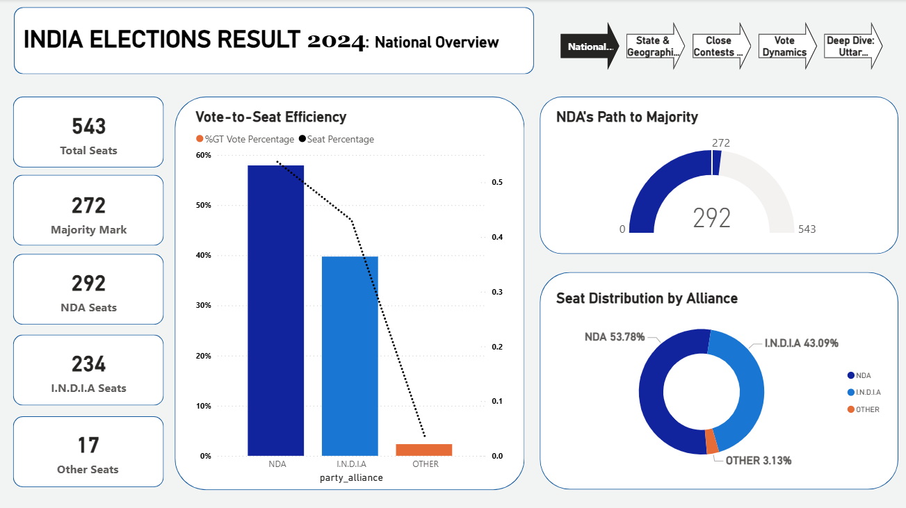
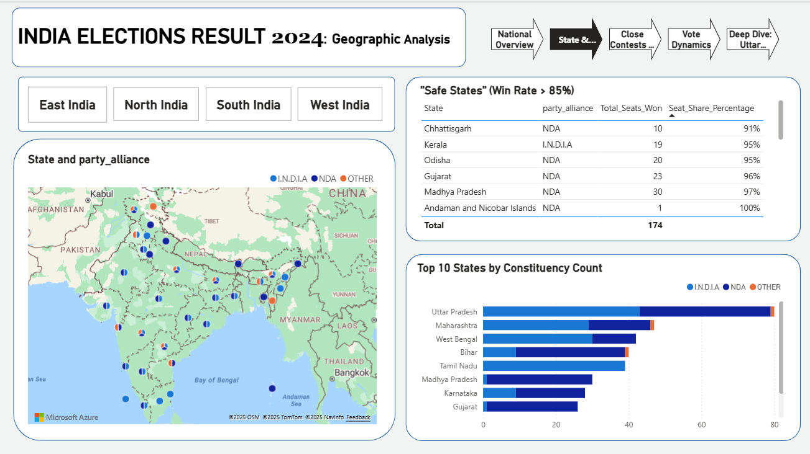
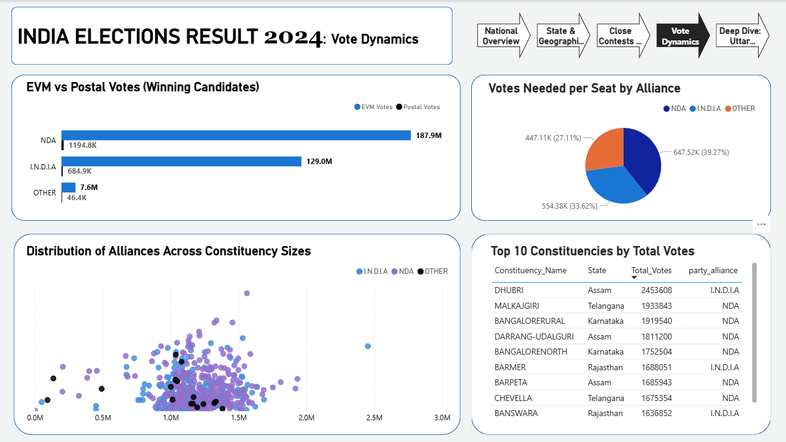

# Analysis of the 2024 Indian General Election Results

## 📜 Project Overview

This project provides a comprehensive and in-depth analysis of the 2024 Indian General (Lok Sabha) Election results. Using a detailed dataset covering constituency, party, and state levels, this analysis explores the key patterns and trends that shaped India's political landscape. The analysis focuses on answering key questions such as:

* What was the final seat distribution among the major political alliances?
* How did the alliances perform in crucial battleground states?
* Which constituencies witnessed the closest electoral battles?
* How efficient was each alliance in converting popular votes into parliamentary seats?

**Data Source:** The data was compiled from public sources for the 2024 Indian election results, including details on candidates, constituencies, parties, and states.

---

## 🛠️ Tech Stack & Tools

-   **SQL (Microsoft SQL Server):** Used for the entire data analysis process, including data cleaning, joining multiple datasets, creating analytical views, and running complex queries to extract insights.
-   **Data Visualization (Power BI):** The primary tool used to create the interactive dashboard and all the charts and maps presented in this analysis.
-   **Data Handling:** CSV files for initial data storage.
-   **Version Control:** Git & GitHub for project management and showcasing.

---

## 📊 Key Findings & Visualizations

This section highlights the main insights derived from the 2024 Indian election data.

### 1. National Overview

The national results show the NDA alliance securing a majority to form the government, but with a strong performance from the I.N.D.I.A alliance, making for a formidable opposition.



* **Total Seats:** 543 | **Majority Mark:** 272
* **NDA Alliance:** Won **293 seats**, securing the majority.
* **I.N.D.I.A Alliance:** Won **233 seats**, showing significant gains.
* **Others:** Secured the remaining **17 seats**.

---

### 2. Geographic Performance of Alliances

The geographic distribution of seats reveals clear regional strongholds for the major alliances. The NDA dominated in the northern and western states, while the I.N.D.I.A alliance showed overwhelming strength in the south.



---

### 3. Close Contest Analysis

A key feature of this election was the high number of constituencies decided by a very narrow margin (< 5000 votes). Maharashtra and Uttar Pradesh led the count for the most nail-biting finishes.


---

### 4. Vote vs. Seat Share Efficiency

This analysis reveals the efficiency of each alliance in converting their vote share into actual seats. The NDA proved to be the most efficient, securing a higher percentage of seats compared to its national vote percentage.



---

### 5. Battleground States: Uttar Pradesh vs. Maharashtra

Uttar Pradesh (80 seats) and Maharashtra (48 seats) were the most critical battlegrounds. Contrary to expectations, the I.N.D.I.A alliance outperformed the NDA in terms of seats won in both states, indicating a significant shift in the political landscape.


---

##  dashboards 
### Interactive Power BI Dashboard

The full interactive dashboard is available as a `.pbix` file in the `/dashboard` directory of this project. To explore the data, please download the file and open it using Microsoft Power BI Desktop.

[Download the Power BI Dashboard file here](dashboard/Analysis%20of%20the%202024%20Indian%20General%20Election%20Results.pbix)

---

## 📂 Project Structure

The repository is organized into the following directories:

-   `**/data/**`: Contains all the raw CSV files used for the analysis.
-   `**/code/**`: Includes the main SQL script (`analysis.sql`) with all the queries.
-   `**/dashboard/**`: Contains the interactive Power BI dashboard file (`.pbix`).
-   `**/visuals/**`: Stores all the visual outputs and charts as `.png` files.
-   `README.md`: This file, providing a comprehensive overview of the project.

---

## 🚀 How to Run and Replicate the Analysis

To replicate this analysis on your local machine, please follow these steps:

1.  **Clone the Repository:**
    ```bash
    git clone [https://github.com/ZiadEhab1444/India-Elections-2024-Analysis.git](https://github.com/ZiadEhab1444/India-Elections-2024-Analysis.git)
    cd India-Elections-2024-Analysis
    ```

2.  **Database Setup:**
    * Ensure you have Microsoft SQL Server installed.
    * Create a new database named `INDIA ELECTIONS RESULT`.

3.  **Data Import:**
    * Import all `.csv` files from the `/data` directory into the database. Ensure the table names match those used in the SQL script.

4.  **Run the Analysis Script:**
    * Execute the entire SQL script located at `/code/analysis.sql`.
